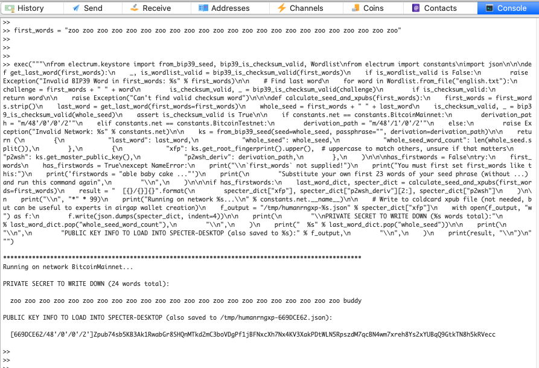

# Last Word Checksum and XFP Calculator

## THIS REPOSITORY COMES WITH ZERO GUARANTEES. USE AT YOUR OWN RISK!

## Instructions:
1. Open Electrum Console tab
2. Enter the following (replace with your seed's first words):
```python
first_words = "abandon abandon abandon abandon abandon abandon abandon abandon abandon abandon abandon"
```
3. Paste the code from [oneline.py](https://raw.githubusercontent.com/mflaxman/human-rng-electrum/master/oneline.py) into the console (it will use whatever you set `first_words` to in the previous step).
4. Private results (last word checksum) will be printed to the screen
5. Public results (extended public key, root fingerprint, and derivation path) are printed to the screen and saved to a file (for export to your multisig setup) in your `/tmp` directory

**Note: it is strongly recommended to perform all these steps (including below) offline on an airgapped machine, preferably using [Tails](https://tails.boum.org/).**

#### Example
Using the following `first_words`:  
`first_words = "define rifle cliff summer priority ability chimney cotton tennis crash husband try trophy ring cook portion drift stool thank ceiling notice lesson foam"`

Which generates the following output:
```
PRIVATE SECRET TO WRITE DOWN:

  {
    "last_word": "armed",
    "whole_seed": "define rifle cliff summer priority ability chimney cotton tennis crash husband try trophy ring cook portion drift stool thank ceiling notice lesson foam armed",
    "whole_seed_word_count": 24
  }

PUBLIC KEY INFO TO LOAD INTO SPECTER-DESKTOP:

  [083AA3DB/48'/0'/0'/2']Zpub75bfxnas1XEzkrBtQS2G1SHXPhFbW647kkRgeuNGb4S3TucLW9YatuBR3XwzWioRma2zbr74Bf8Z767HYAQcQRQAvmmfigNLtXp1rpaAbhK
```



You can confirm this matches SeedPicker:  
<http://seedpicker.net/calculator/last-word.html>

---

## Build Steps For Trust Minimization
Yes, this is sketchy!
Electrum console has poor copy-paste support. We need our whole code in one-line.

#### Copy Code to Clipboard
Take the code from this repo (see `electrum.py`) and load it into your clipboard.

On MacOS, you can run:
```bash
$ cat electrum.py | pbcopy
```

#### Convert to One-Line
Convert code in your clipboard to one-liner on this website:
https://jagt.github.io/python-single-line-convert/

Select `Python 3` radio button, paste your code, and  hit `Convert`.

#### Save the Resulting File
This is how [oneline.py](oneline.py) was created.

On MacOS, you can run:
```bash
$ pbpaste > oneline.py
```

Now you can use the steps at the top to calculate your last word checksum and root fingerpint.
